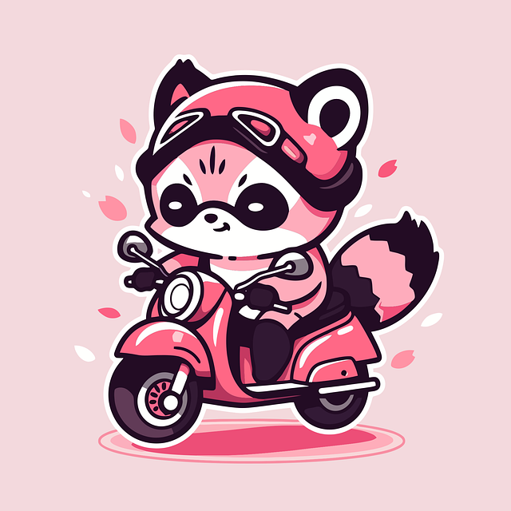
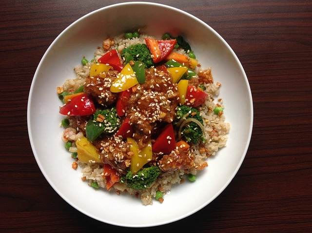

# 자바스크립트 미니 프로젝트 

## hello javaScript! 

프로젝트 : 07월 28일 - 07월 30일 완료 

부족한점 : local storage를 통하여 중복 추천을 방지하려 하였으나 로직을 아직 알기 어려워 성공하지 못하였음 

---
로직 코드 

```html 
<!DOCTYPE html>
<html lang="ko">
  <head>
    <meta charset="UTF-8" />
    <meta name="viewport" content="width=device-width, initial-scale=1.0" />
    <title>너구리</title>
    <link rel="stylesheet" href="./css/reset.css" />
    <link rel="stylesheet" href="./css/style.css" />

    <script src="./js/main.js" defer></script>
  </head>
  <body>
    <div class="wrap">
      <div class="speech-bubble"><p>오늘 뭐먹을거야?</p></div>
      
    </div>

    <div class="result">
      <div class="result_card"></div>
      <div class="result_text"></div>
    </div>

    <div class="filter-button">
      <strong class="mainment">제외 시키실 음식 카테고리를 고르세요</strong>
      <div class="button-class hidden">
        <input type="checkbox" id="korean"><label for="korean">한식 </label>
        <input type="checkbox" id="chinese"><label for="chinese">중식 </label>
        <input type="checkbox" id="western"><label for="western">양식 </label>
        <input type="checkbox" id="japanese"><label for="japanese">일식 </label>
      </div>
    </div>
    <audio src="./sound/13.Game Start by plasterbrain Id-243020.wav" id="audio"></audio>
  </body>
</html>

```

``` css 
@charset 'utf-8';

body {
  height: 100vh;
  display: flex;
  justify-content: center;
  align-items: center;
}


.wrap .raccoon {
  width: 200px;
  height: 200px;
  border: 1px solid #fff;
  border-radius: 50%;
  cursor: pointer 
}

.speech-bubble {
  position: relative;
  background: #00aabb;
  border-radius: 0.4em;
  height: 50px;
  margin-bottom: 50px;
  pointer-events: none; /* 마우스와 관련해서 반응시키지 않는 명령 */
  user-select: none;
}

.speech-bubble p {
  text-align: center;
  display: flex;
  justify-content: center;
  align-items: center;
  padding: 15px;
  font-weight: bold;
  font-size: 17px;
  font-family: 'Pretendard';
  pointer-events: none; /* 마우스와 관련해서 반응시키지 않는 명령 */
  user-select: none;
}

.speech-bubble:after {
  content: '';
  position: absolute;
  bottom: 0;
  left: 50%;
  width: 0;
  height: 0;
  border: 44px solid transparent;
  border-top-color: #00aabb;
  border-bottom: 0;
  border-left: 0;
  margin-left: -22px;
  margin-bottom: -44px;
  pointer-events: none; /* 마우스와 관련해서 반응시키지 않는 명령 */
  user-select: none;
}


.result {
  position: fixed;
  top: 50%;
  left: 50%;
  transform: translate(-50%, -50%); /* 정가운데로 고정 */
  width: 300px;
  height: 350px;
  pointer-events: none; /* 마우스와 관련해서 반응시키지 않는 명령 */
  user-select: none;
  z-index: 11;
}


.result .result_card {
  position: absolute;
  top: 0%;
  width: 350px;
  height: 350px;
  border: 10px solid #000;
  border-radius: 50%;
  display: flex;
  justify-content: center;
  align-items: center;
  pointer-events: none; /* 마우스와 관련해서 반응시키지 않는 명령 */
  user-select: none;

}


body::before {
  opacity: 0;
  content: '';
  display: block;
  position: absolute;
  top: 0;
  left: 0;
  background: rgba(0, 0, 0, 0.3);
  width: 100%;
  height: 100%;
  backdrop-filter: blur(10px);
  transition: 0.4s;
  pointer-events: none; /* 마우스와 관련해서 반응시키지 않는 명령 */
  user-select: none;
}


body.action::before {
  opacity: 1;
  z-index: 10;
}


.result_card {
  left: -450%;
  border: 1px solid #000;
  transition: 0.4s cubic-bezier(0, 0.37, 0.25, 1.29);
  border-radius: 50%;

  pointer-events: none; /* 마우스와 관련해서 반응시키지 않는 명령 */
  user-select: none;


}

body.action .result_card {
  left: 0;
  overflow: hidden;
  animation: slide-in-elliptic-top-fwd 0.7s cubic-bezier(0.250, 0.460, 0.450, 0.940) both;
}

.result_text {
  position: absolute;
  top: 110%;
  left: 43%;
  transform: translate(-50%, -50%);

  color: #fff;
  background: purple;
  border: 1px solid #000;
  border-radius: 30px;
  padding: 10px 20px;
  opacity: 0;
  font-family: 'Pretendard';


}

body.action .result_text {
  transform: translate(-50%, -50%);
  opacity: 1;
  animation: roll-in-left 0.6s ease-out both;

}

.mainment{
  display: flex;
  width: 300px;
  height: 50px;
  background: #ffebcd;
  justify-content: center;
  align-items: center;
  border: 1px solid #fff;
  border-radius: 20px;
  padding: 5px;
  pointer-events: none; /* 마우스와 관련해서 반응시키지 않는 명령 */
  user-select: none;
}

.filter-button{
  position: absolute;
  width: 290px;
  height: 150px;
  /* background: yellow; */
  bottom: 30px;


}


.button-class{
  margin-top: 20px;
  display: flex;
  justify-content: space-between;
  align-items: center;
  z-index: -100;
}

input[type="checkbox"] {

  background: #fff;
  border-radius: 4px;
  cursor: pointer;
  height: 16px;
  outline: 0;
  width: 16px;
  cursor: pointer;
  z-index: 1;
}

input[type="checkbox"]:checked {
  background: #505bf0;

}
input[type="checkbox"]:checked::after {
  display: block;
}

@-webkit-keyframes slide-in-elliptic-top-fwd {
  0% {
    -webkit-transform: translateY(-600px) rotateX(-30deg) scale(0);
            transform: translateY(-600px) rotateX(-30deg) scale(0);
    -webkit-transform-origin: 50% 100%;
            transform-origin: 50% 100%;
    opacity: 0;
  }
  100% {
    -webkit-transform: translateY(0) rotateX(0) scale(1);
            transform: translateY(0) rotateX(0) scale(1);
    -webkit-transform-origin: 50% 1400px;
            transform-origin: 50% 1400px;
    opacity: 1;
  }
}
@keyframes slide-in-elliptic-top-fwd {
  0% {
    -webkit-transform: translateY(-600px) rotateX(-30deg) scale(0);
            transform: translateY(-600px) rotateX(-30deg) scale(0);
    -webkit-transform-origin: 50% 100%;
            transform-origin: 50% 100%;
    opacity: 0;
  }
  100% {
    -webkit-transform: translateY(0) rotateX(0) scale(1);
            transform: translateY(0) rotateX(0) scale(1);
    -webkit-transform-origin: 50% 1400px;
            transform-origin: 50% 1400px;
    opacity: 1;
  }
}

@-webkit-keyframes roll-in-left {
  0% {
    -webkit-transform: translateX(-800px) rotate(-540deg);
            transform: translateX(-800px) rotate(-540deg);
    opacity: 0;
  }
  100% {
    -webkit-transform: translateX(0) rotate(0deg);
            transform: translateX(0) rotate(0deg);
    opacity: 1;
  }
}
@keyframes roll-in-left {
  0% {
    -webkit-transform: translateX(-800px) rotate(-540deg);
            transform: translateX(-800px) rotate(-540deg);
    opacity: 0;
  }
  100% {
    -webkit-transform: translateX(0) rotate(0deg);
            transform: translateX(0) rotate(0deg);
    opacity: 1;
  }
}
```

```js 

const $body = document.body;
const $racconChoice = document.querySelector('.raccoon');
const $resultText = document.querySelector('.result_text');
const $resultImg = document.querySelector('.result_card');
const $Audio = document.querySelector('#audio')

const $krCheck = document.querySelector('#korean');
const $cnCheck = document.querySelector('#chinese');
const $wtCheck = document.querySelector('#western');
const $jnCheck = document.querySelector('#japanese');

const foodArray = [
  { food: '볶음밥', category : '중식', image: './img/1.jpg' },
  { food: '짜장면', category: '중식', image: './img/2.jpg' },
  { food: '피자', category: '양식', image: './img/5.jpg' },
  { food: '파스타', category: '양식', image: './img/3.jpg' },
  { food: '제육덮밥', category: '한식', image: './img/4.jpg' },
  { food: '김치찌개', category: '한식', image: './img/6.jpg' },
  { food: '연어초밥', category: '일식', image: './img/7.jpg' },
  { food: '붓카케우동', category: '일식', image: './img/8.jpg' },
  
];


let ranChoice = Math.floor(Math.random() * foodArray.length);

let resultText = foodArray[ranChoice].food;
let resultImage = foodArray[ranChoice].image;


$racconChoice.addEventListener('click', function () {

    $Audio.play();
    $body.classList.add('action');
    let filterFood = foodArray;
    let filterFoods;
    let filterChoice;
    let filterText;
  
    if( $krCheck.checked ) {
      filterFoods = filterFood.filter(food => food.category !== '한식');
      filterChoice = Math.floor(Math.random() * filterFoods.length);
      filterText = filterFoods[filterChoice].food;
      filterImage = filterFoods[filterChoice].image;
      $resultText.textContent = filterText;
      $resultImg.innerHTML = ``;
  
    }else if( $cnCheck.checked){
      filterFoods = filterFood.filter(food => food.category !== '중식');
      filterChoice = Math.floor(Math.random() * filterFoods.length);
      filterText = filterFoods[filterChoice].food;
      filterImage = filterFoods[filterChoice].image;
      $resultText.textContent = filterText;
      $resultImg.innerHTML = ``;
  
    }else if($wtCheck.checked){
      filterFoods = filterFood.filter(food => food.category !== '양식');
      filterChoice = Math.floor(Math.random() * filterFoods.length);
      filterText = filterFoods[filterChoice].food;
      filterImage = filterFoods[filterChoice].image;
      $resultText.textContent = filterText;
      $resultImg.innerHTML = ``;
  
    } else if($jnCheck.checked){
      filterFoods = filterFood.filter(food => food.category !== '일식');
      filterChoice = Math.floor(Math.random() * filterFoods.length);
      filterText = filterFoods[filterChoice].food;
      filterImage = filterFoods[filterChoice].image;
      $resultText.textContent = filterText;
      $resultImg.innerHTML = ``;
    }else {
      console.log(localStorage.getItem('resultValue'));
      $resultText.textContent = resultText;
      $resultImg.innerHTML = ``;
      }
  
});

```

# 🎂 주목해야 할 사항 

```js
$racconChoice.addEventListener('click', function () {

    $Audio.play();
    $body.classList.add('action');
    let filterFood = foodArray;
    let filterFoods;
    let filterChoice;
    let filterText;
  
    if( $krCheck.checked ) {
      filterFoods = filterFood.filter(food => food.category !== '한식');
      filterChoice = Math.floor(Math.random() * filterFoods.length);
      filterText = filterFoods[filterChoice].food;
      filterImage = filterFoods[filterChoice].image;
      $resultText.textContent = filterText;
      $resultImg.innerHTML = ``;
  
    }else if( $cnCheck.checked){
      filterFoods = filterFood.filter(food => food.category !== '중식');
      filterChoice = Math.floor(Math.random() * filterFoods.length);
      filterText = filterFoods[filterChoice].food;
      filterImage = filterFoods[filterChoice].image;
      $resultText.textContent = filterText;
      $resultImg.innerHTML = ``;
  
    }else if($wtCheck.checked){
      filterFoods = filterFood.filter(food => food.category !== '양식');
      filterChoice = Math.floor(Math.random() * filterFoods.length);
      filterText = filterFoods[filterChoice].food;
      filterImage = filterFoods[filterChoice].image;
      $resultText.textContent = filterText;
      $resultImg.innerHTML = ``;
  
    } else if($jnCheck.checked){
      filterFoods = filterFood.filter(food => food.category !== '일식');
      filterChoice = Math.floor(Math.random() * filterFoods.length);
      filterText = filterFoods[filterChoice].food;
      filterImage = filterFoods[filterChoice].image;
      $resultText.textContent = filterText;
      $resultImg.innerHTML = ``;
    }else {
      console.log(localStorage.getItem('resultValue'));
      $resultText.textContent = resultText;
      $resultImg.innerHTML = ``;
```
객체가 저장되어 있는 array안 food들의 카테고리들을 필터링 하여 만약 체크 박스가 걸려있는 카테고리 예: 한식 → 한식을 제외한 ARRAY들이 랜덤 필터를 돌며 메뉴를 추천 

